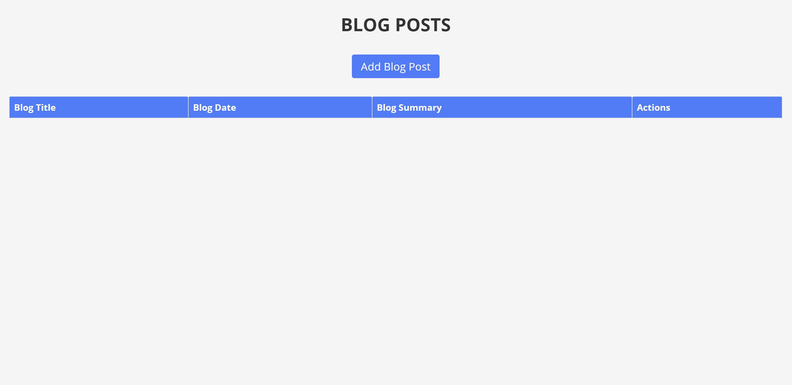
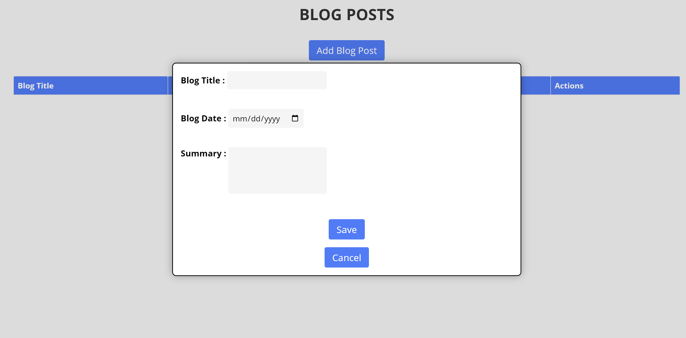
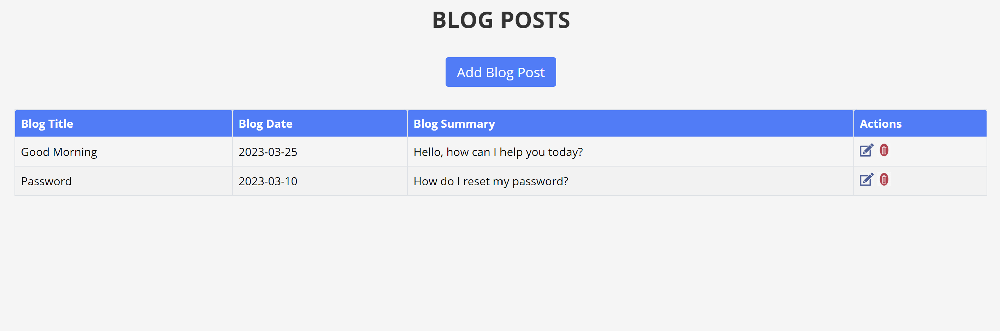

# CRUD Blog Posts

This is a simple CRUD (Create, Read, Update, Delete) application for blog posts. It allows the user to add, edit, and delete blog posts, and view a list of all posts.

## Page Link

- <https://lively-peony-f558d2.netlify.app/>

## Features

- Add new blog post with title, date, and summaryEdit an existing blog post
- Delete blog post
- View list of all blog posts
- The page is fully responsive and fits all kinds of screen sizes
- Adding, editing, and deleting blog posts reflect the browser's local storage as well so your data will be available even if you are offline or close the browser and come back later.

## Technologies Used

- HTML
- CSS
- JavaScript

## Usage

1. Clone the repository: git clone <https://github.com/your-username/crud-blog-posts.git>

2. Open the index.html file in your web browser.

3. To add a new blog post, click the "Add Blog Post" button and fill out the form.

4. To edit an existing blog post, click the "Edit" button next to the post you want to edit and make your changes in the form.

5. To delete a blog post, click the "Delete" button next to the post you want to delete.

## Contributors

- Adam Alemi <naseralemi12@gmail.com>

## Screenshots

- 
- 
- 
